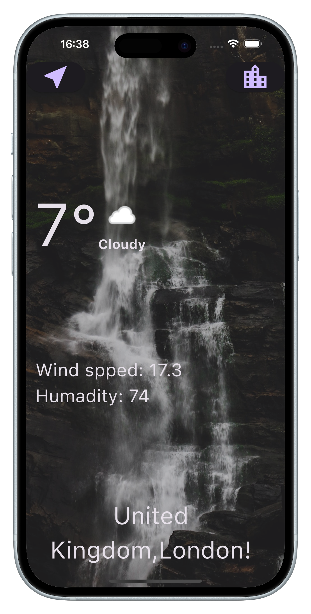

# Weather App

Welcome to the *Weather App*, your go-to application for accurate and up-to-date weather forecasts.

## Overview
The Weather App provides real-time weather updates for any location worldwide. Featuring an intuitive user interface, the app is perfect for planning your day or keeping track of changing weather conditions.

---

## Key Features
- Real-time weather updates for your location.
- Detailed forecasts, including temperature, humidity, wind speed, and precipitation.
- Search and save your favorite locations.
- Clean and user-friendly interface.

---

## Screenshots

Here are some screenshots to give you a sneak peek into the app's interface. Replace the placeholders below with actual images once available:

### Home Screen

Displays the current weather for your location.

### Search Screen

Easily search for weather updates for different cities.

### Detailed Forecast

Get an hour-by-hour and 7-day weather forecast.

---

## Getting Started

To get started with the Weather App, follow these steps:

1. Clone the repository:
   bash
   git clone https://github.com/your-username/weather_app.git

2. Navigate to the project directory:
   bash
   cd weather_app

3. Install the dependencies:
   bash
   flutter pub get

4. Run the app:
   bash
   flutter run

---

## Requirements
- Flutter SDK version 3.0.0 or above
- Android Studio or Xcode for emulators
- A device or emulator to run the app

---

## Resources
- *Flutter Documentation:* [https://docs.flutter.dev/](https://docs.flutter.dev/)
- *Lab: Write your first Flutter app:* [https://docs.flutter.dev/get-started/codelab](https://docs.flutter.dev/get-started/codelab)
- *Flutter Cookbook:* [https://docs.flutter.dev/cookbook](https://docs.flutter.dev/cookbook)

---

## Feedback and Contributions
We welcome feedback and contributions to improve the Weather App. Please feel free to submit an issue or pull request on GitHub.

---

## License
This project is licensed under the MIT License. See the LICENSE file for more details.

---

Enjoy using the Weather App! 🌦️